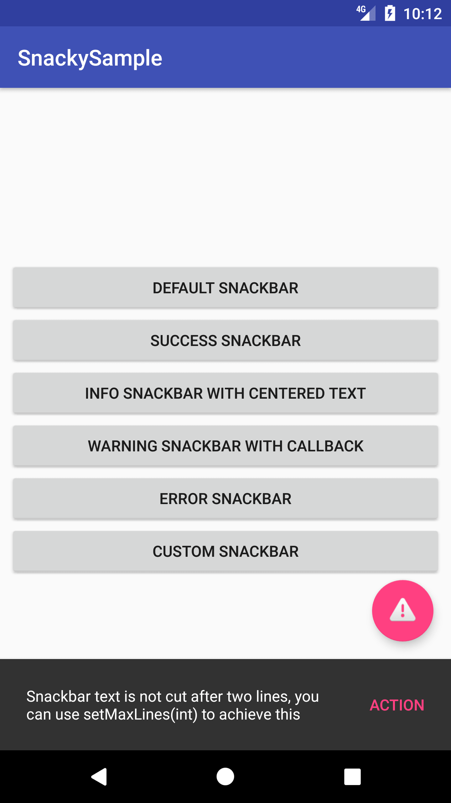
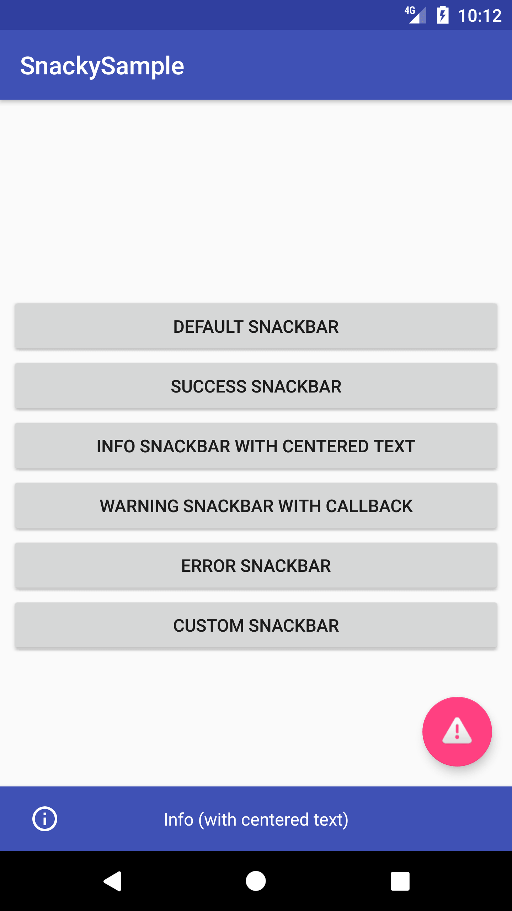
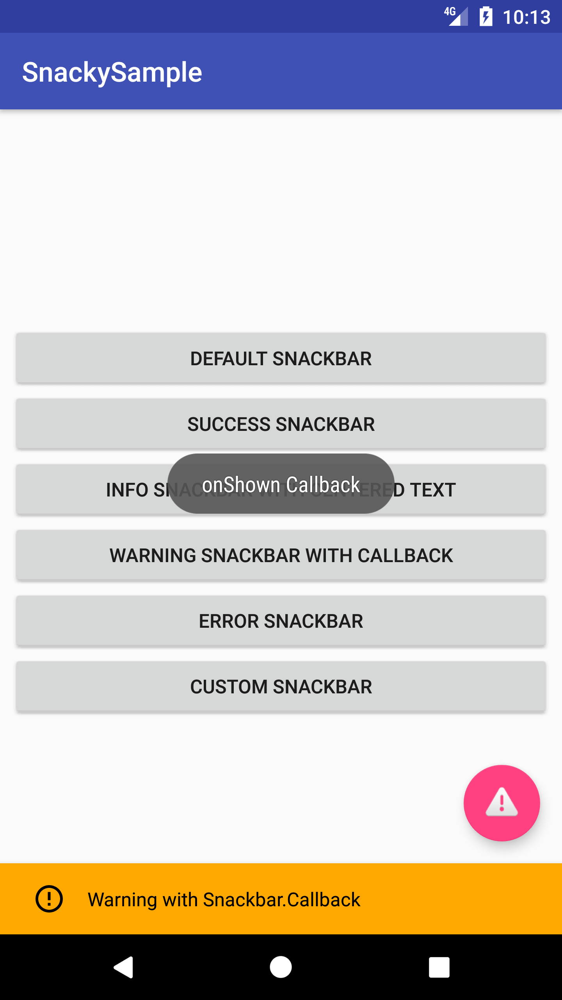
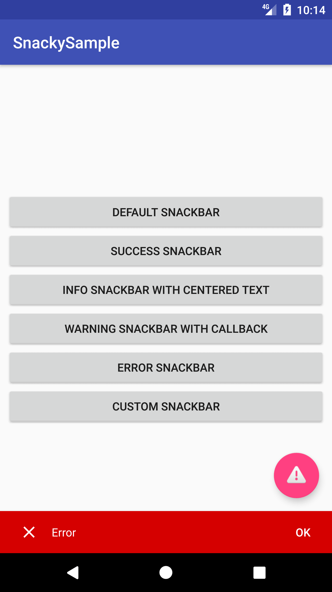
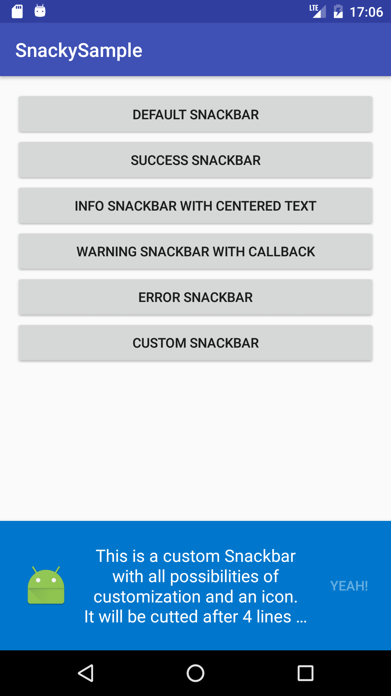

[](https://jitpack.io/#matecode/Snacky)
[](https://android-arsenal.com/api?level=14)
[](https://android.libhunt.com/project/snacky)

[](https://donorbox.org/matecode)

# Snacky

Snacky is a small library to help you adding a [Snackbar](https://developer.android.com/reference/android/support/design/widget/Snackbar.html) to your layout with ease. It was created because of my own needs and is inspired by [Toasty](https://github.com/GrenderG/Toasty). Snacky uses an easy builder pattern to build a Snackbar and gives you some template designs like ERROR, WARNING, INFO and SUCCESS as well as some customization options. See code samples below

:bangbang: As of version 1.1.4 Snacky is is only compatible with androidX and not longer with support library apps! :bangbang:

## Screenshots








## Usage

Using Snacky is really simple. 

#### Initialisation

Start with `Snacky.builder()` to get a Builder. 

It is necessary to set an activity or View for the snackbar.

`.setView(View view)` will use the view for the snackbar to show, or you choose

`.setActivity(Activity activity)` which will automatically find the root view of the activity

#### Customization

most of them are self-explaining, all colors are *not* Resource Ids, but parsed colors, so use ContextCompat.getColor() if you want to use Resource-colors)

`.setBackgroundColor()` Color

`.setText()` Charset or IntRes for text

`.setTextColor()` Color or ColorStateList

`.setTextSize()` size in SP or with ComplexUnit

`.setTextTypeface()` Typeface

`.setTextTypefaceStyle()` NORMAL, BOLD, ITALIC, BOLD_ITALIC from [Typeface](https://developer.android.com/reference/android/graphics/Typeface.html)

`.setMaxLines()` max lines of Snackbar, off by default

`.centerText()` centers the text

`.setActionText()`

`.setActionTextColor()` Color or ColorStateList

`.setActionTextSize()`

`.setActionTextTypeface()`

`.setActionTextTypefaceStyle()` like .setTextTypefaceStyle()

`.setActionClickListener(View.OnClickListener)`

`.setDuration(Snacky.DURATION)` SHORT, LONG, INDEFINITE

`.setIcon()` Drawable to be shown, in my opinion ist best to use small drawables with 24dp size

#### Building

`.build()` gives you the Snackbar, but you can also use some predefined templates:

`.success()`

`.error()`

`.info()`

`.warning()`

All give you a snackbar object, but some set predefined values if you didn't customize them before.

#### Using the snackbar

After that you can handle the snackbar as you know it:

`.addCallback(SnackBar.Callback)` adds a callback to the snackbar

`.show()` shows the snackbar

## Example

See [ExampleActivity.java](https://github.com/matecode/Snacky/blob/master/app/src/main/java/de/mateware/snackysample/ExampleActivity.java) for a list of examples as shown in [Screenshots](#screenshots).

There you can also the see the right use of CoordinatorLayout and FloatingActionButton. For Snacky Builder just use the view from OnClickListener in FAB to animate it on click. 

## Installation

Snacky is published via Jitpack. Add this in your root `build.gradle` file (**not** your module `build.gradle` file):

```gradle
allprojects {
    repositories {
        ...
        maven { url "https://jitpack.io" }
    }
}
```

Add this to your module's `build.gradle` file (make sure the version matches the JitPack badge above):

```gradle
dependencies {
    ...
    implementation 'com.github.matecode:Snacky:1.1.5'
    implementation 'com.google.android.material:material:1.0.0'
}
```

## Licence

```
Copyright 2018 Mate Siede

Licensed under the Apache License, Version 2.0 (the "License");
you may not use this file except in compliance with the License.
You may obtain a copy of the License at

    http://www.apache.org/licenses/LICENSE-2.0

Unless required by applicable law or agreed to in writing, software
distributed under the License is distributed on an "AS IS" BASIS,
WITHOUT WARRANTIES OR CONDITIONS OF ANY KIND, either express or implied.
See the License for the specific language governing permissions and
limitations under the License.
```
